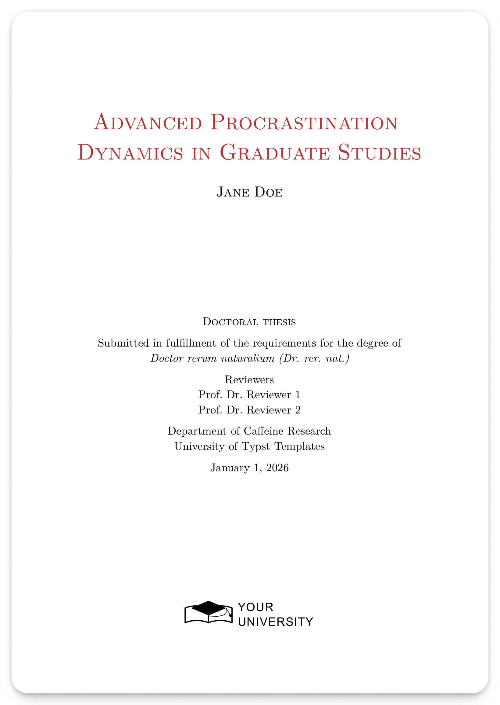

# Typst Template For A Phd Thesis

Typst template for cumulative PhD thesis: compile your main text, list published papers,
and merge the PDFs of your publications into a single thesis. 

  

## What’s inside
- `main.typ`: entrypoint with metadata (title/author/university/dates) and example chapters.
- `template.typ`, `definitions.typ`, `constants.typ`, `colors.typ`: layout, spacing, helpers, and
  color palette shared across pages.
- `pages.typ` and `pages/*.typ`: front/back matter (abstracts, acknowledgments, notation, acronyms,
  publication list).
- `paper/`: PDFs of accepted/published papers that get merged for the cumulative build.
- `bibliography.bib` with `csl/` styles for citations; `res/` for figures.
- `compile.sh`: Since typst does not support splicing other PDF pages into the output PDF, we need additional script that takes the typst generated PDF and inserts the papers in `papers/` into the final PDF at the correct positions. If you are writing a monography instead, you can ignore this.

Check out [main.pdf](./main.pdf) for the compiled `main.typ` file and [dissertation.pdf](./dissertation.pdf) for the `main.pdf` merged with the papers in [paper/](./paper).

## Getting started
1) Set your metadata in `main.typ` under `project.with(...)`.
2) Replace the sample chapter text with your content and adjust front/back matter pages under
   `pages/*.typ`.
3) Add your figures to `res/` and citations to `bibliography.bib`.
4) Replace the logo in `res/logo-front.svg` with your university logo.
4) Drop your paper PDFs into `paper/`.

## Build commands
- `typst compile main.typ`: compile the main document to `main.pdf`.
- `typst watch main.typ`: live rebuild while editing.
- `./compile.sh`: full pipeline including paper PDF merging (requires `pdftk` and Ghostscript `gs`).
